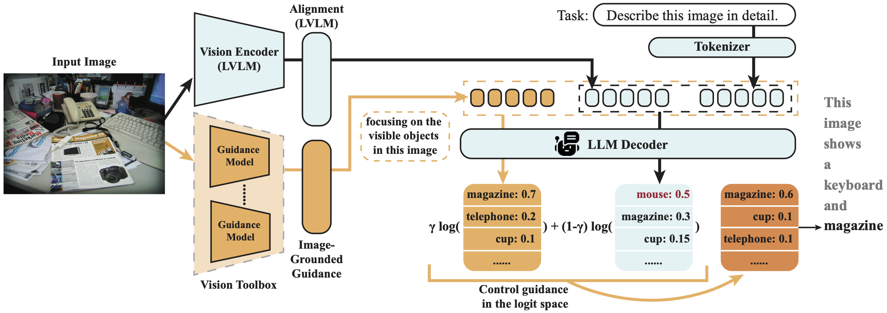

# MARINE🐳: Mitigating Object Hallucination in Large Vision-Language Models via Image-Grounded Guidance

<p align="center">
  
</p>


<p align="center" style="font-weight:bold; margin-bottom: 0.5em;">
  🔎 Official Repository for the Paper
</p>
<p align="center" style="font-size:20px; font-weight:bold;">
  Mitigating Object Hallucination in Large Vision-Language Models via Image-Grounded Guidance
</p>


<p align="center">
  <strong>Linxi Zhao<sup>1*</sup>, Yihe Deng<sup>2*</sup>, Weitong Zhang<sup>2</sup>, Quanquan Gu<sup>2</sup></strong><br>
  <em><sup>1</sup>Cornell &nbsp;&nbsp;|&nbsp;&nbsp; <sup>2</sup>UCLA</em><br>
  <em><sup>*</sup>Equal contribution</em>
</p>

<p align="center">
  <strong>📌 [ICML 2025 Spotlight]</strong> • 
  <a href="https://arxiv.org/abs/2402.08680">📄 ArXiv: 2402.08680</a>
</p>


---

## Overview

We introduce MARINE, a general framework for mitigating object hallucinations in LVLMs by guiding generation with image-grounded visual models, consistently outperforming baselines in object hallucination mitigation.

<p align="center">
  
</p>

---
## Table of Contents
- [Installation](#installation)
- [Apply MARINE to Your Own LVLM](#apply-marine-to-your-own-lvlm)
- [Example Usage with MARINE](#example-usage-with-marine)
- [Citation](#citation)
- [Acknowledgment](#acknowledgment)


---
<a name="-installation"></a>


## Installation

### 1. Install MARINE

Clone the repo and install the MARINE package in editable mode:

```bash
git clone https://github.com/Linxi-ZHAO/MARINE.git
cd MARINE
pip install -e .
```

---

### 2. Install Required Dependencies

Install runtime dependencies listed in [`requirements.txt`](./requirements.txt):

```bash
pip install -r requirements.txt
```

---

### 3. Install External Libraries and Datasets

#### External LVLMs

MARINE interfaces with multiple open-source Large Vision-Language Models (LVLMs).
Please **follow their setup instructions manually** before running MARINE:

Visual Grounding Models:
* [RAM++](https://github.com/xinyu1205/recognize-anything)
```bash
pip install git+https://github.com/xinyu1205/recognize-anything.git
```

LVLMs:
* (Example) 
  * [LLaVA](https://github.com/haotian-liu/LLaVA)
* (Optional) 
  * [mPLUG-Owl2](https://github.com/X-PLUG/mPLUG-Owl)
  * [InstructBLIP](https://github.com/salesforce/LAVIS/tree/main/projects/instructblip)
  * [MiniGPT-4](https://github.com/Vision-CAIR/MiniGPT-4)


---

#### COCO Dataset

Download the COCO 2014 validation images and annotations:

```bash
# Images
mkdir -p ./data/coco
cd ./data/coco
wget http://images.cocodataset.org/zips/val2014.zip
unzip val2014.zip

# Annotations (ensure this ends up in ./data/coco/annotations)
mkdir -p ./data/coco/annotations
cd ./data/coco/annotations
wget http://images.cocodataset.org/annotations/annotations_trainval2014.zip
unzip annotations_trainval2014.zip
```

---
<a name="apply-marine"></a>

## Apply MARINE to Your Own LVLM

MARINE is designed to be plug-and-play. You can integrate it into **any Hugging Face-compatible LVLM** by adding a custom `logits_processor` during decoding.

After preparing MARINE guidance in advance, simply use the `GuidanceLogits` module to inject visual grounding into the generation process:

```python
from transformers import LogitsProcessorList
from marine.guidance_logits import GuidanceLogits

output_ids = model.generate(
    input_ids=input_ids,
    pixel_values=images,
    do_sample=False,
    max_new_tokens=64,
    use_cache=True,
    logits_processor=LogitsProcessorList([
        GuidanceLogits(
            guidance_strength=guidance_strength,
            guidance=guidance_ids,
            images=guidance_images,
            attention_mask=guidance_attention_masks,
            model=model,
            tokenizer=tokenizer
        ),
    ])
)
```


---
<a name="example-usage"></a>

## Example Usage with MARINE

We provide example scripts to run MARINE with open-source LVLMs on the COCO dataset.
This includes preparing visual guidance and evaluating outputs using hallucination benchmarks like CHAIR and POPE.

### Step 1: Prepare MARINE Guidance

We use **DETR** and **RAM++** to extract object-level visual guidance, then combine them to form MARINE guidance.

You can run everything with:

```bash
bash scripts/prepare_marine_input.sh
```

### Step 2: Run LVLM Generation + Evaluation

We provide example scripts for LLaVA v1.5:

```bash
bash scripts/eval_llava2.sh
```

This script generates answers and evaluates them using the CHAIR and POPE metrics.

#### Generation (LLaVA v1.5)

```bash
python ./marine/generate_llava2.py \
    --question_file $QUESTION_FILE \
    --guidance_strength $guidance_strength \
    --answer_path $OUTPUT_DIR \
    --model_path $MODEL_VERSION \
    --seed $SEED \
    --batch_size $BATCH_SIZE \
    --image_folder ./data/coco/val2014 \
    --temperature 0.6 \
    --top_p 0.9 \
    --max_new_tokens 64
```

#### Evaluation (CHAIR)

```bash
python ./eval/eval_chair.py \
    --eval_dir $OUTPUT_DIR
    --save_path $OUTPUT_DIR/eval \
```

#### Evaluation (POPE)

```bash
python ./eval/eval_pope.py \
    --eval_dir $OUTPUT_DIR \
    --save_dir $OUTPUT_DIR/eval \
    --label_file $QUESTION_FILE \
            
```


---

## Citation

If you find this work helpful, please consider citing:

```bibtex
@misc{zhao2024mitigatingobjecthallucinationlarge,
      title={Mitigating Object Hallucination in Large Vision-Language Models via Classifier-Free Guidance}, 
      author={Linxi Zhao and Yihe Deng and Weitong Zhang and Quanquan Gu},
      year={2024},
      eprint={2402.08680},
      archivePrefix={arXiv},
      primaryClass={cs.LG},
      url={https://arxiv.org/abs/2402.08680}, 
}
```

---

## Acknowledgment

This work builds on several open-source projects, including [CHAIR Metric](https://github.com/LisaAnne/Hallucination), [POPE Metric](https://github.com/RUCAIBox/POPE), and [LLaVA](https://github.com/haotian-liu/LLaVA). We also acknowledge the availability of models such as [mPLUG-Owl2](https://github.com/X-PLUG/mPLUG-Owl), [InstructBLIP](https://github.com/salesforce/LAVIS), and [MiniGPT-4](https://github.com/Vision-CAIR/MiniGPT-4), which are compatible with our framework.
